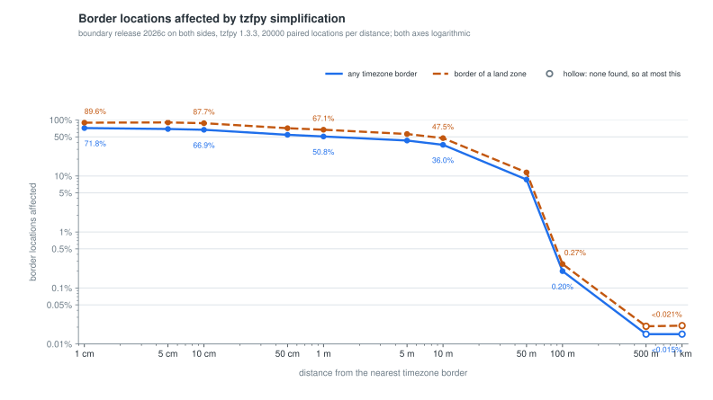

============
Alternatives
============

The position in one paragraph
-----------------------------

``timezonefinder`` optimises for **correctness at timezone borders**. It stores the boundary
polygons exactly as the source dataset provides them - every vertex of every polygon and every
hole, at ~1 cm coordinate resolution - and never simplifies them. :doc:`data_report` is generated
from the packaged data and carries the current counts. Speed is the constraint that work is done
under, not the goal: the H3 spatial
index, the integer coordinate representation and the optional acceleration backends exist to make
full-resolution geometry affordable, not to shave the last microsecond off a lookup.

`tzfpy <https://github.com/ringsaturn/tzfpy>`__ makes the opposite trade, deliberately and well. It
ships simplified polygons, which makes it smaller and faster per query, at the cost of accuracy near
the borders those polygons describe. The two are now measured against each other under one harness -
same query points, same process, same machine - in :doc:`benchmark_results_comparison`.

**If your query points are rarely near a timezone border - coarse geofencing, analytics
aggregation, high-volume classification where an occasional wrong answer within a few hundred
metres of a boundary costs nothing - choose ``tzfpy``.** It is a good package, it will serve you
better, and its maintainer is a contributor to this one (see :doc:`3_about`). If a wrong answer at
a border is a bug rather than a rounding error, that is what this package is for.

Alternative python packages
---------------------------

- `tzfpy <https://github.com/ringsaturn/tzfpy>`__ - less accurate, more lightweight, faster per lookup
- `pytzwhere <https://pypi.python.org/pypi/tzwhere>`__ - not maintained

Comparison to tzfpy
-------------------

``tzfpy`` is a Python binding of the Rust package ``tzf-rs``. Both packages use the full original
dataset (>440 timezones), so both offer full localization and historical timezone accuracy; the
difference is in what they do with that dataset's geometry.

.. list-table::
   :header-rows: 1
   :widths: 24 40 36

   * - Feature
     - timezonefinder
     - tzfpy
   * - Implementation
     - Pure Python, with an optional C extension and optional Numba JIT compilation
     - Python binding of the Rust crate ``tzf-rs``
   * - Dataset Version
     - Full original dataset (>440 timezones)
     - Full original dataset (>440 timezones)
   * - Data Representation
     - Complete, non-simplified polygons at ~1 cm coordinate resolution; :doc:`data_report` lists the current vertex, polygon and hole counts
     - Simplified polygons, by design
   * - Border Accuracy
     - Limited only by the source dataset
     - Reduced near borders, in proportion to the simplification
   * - Spatial Index
     - H3 hexagons at resolution 4 (~288k cells); :doc:`data_report` lists the index size
     - Hierarchical tree of ~80k rectangles, falling back to the simplified polygon data
   * - Time to First Answer
     - Imports NumPy and H3, then reads its index when a finder is constructed (:doc:`benchmark_results_initialization`)
     - Imports in about a millisecond, then deserialises its index inside the *first query*
   * - Avg. Lookup Speed
     - Hundreds of thousands of queries/s on one core; :doc:`benchmark_results_timezonefinding` carries the measured figure and names the configuration behind it
     - Faster per query, by a small single-digit factor on a representative query mix and by a larger single-digit one on the ambiguous points that cost this package the most (:doc:`benchmark_results_comparison`)
   * - Memory Usage
     - Single-digit MiB allocated by default (polygon data stays memory-mapped), an order of magnitude more with ``in_memory=True`` (:doc:`benchmark_results_memory`)
     - Not measured here
   * - Distribution Size
     - Tens of MB per wheel, nearly all of it the packaged boundary data (:doc:`data_report` lists the installed binary sizes)
     - A few MB per wheel
   * - Build & Platform Coverage
     - Builds without a Rust toolchain; the C extension is optional and its absence only costs speed
     - Requires Rust to build wheels on platforms or Python versions without a prebuilt one
   * - Additional Features
     - ``get_geometry()`` returns the timezone shapes
     - Returns GeoJSON representations of the shapes and the timezone's indexes
   * - Maintainership
     - Single repository
     - Downstream of several repositories (tzf, tzf-rel, tzf-rs) across Go, Rust and Python

.. note::

   **The speed rows are measured, not estimated.** ``benchmarks/test_comparison.py`` runs both
   packages over the same committed query points, in the same process, on the same machine, and
   :doc:`benchmark_results_comparison` is generated from it. That harness exists because the
   alternative - putting two published figures side by side - is exactly the comparison this
   project refuses to make about itself: an unchanged lookup path spread 134-158 % across CI
   runners alone (:doc:`benchmarking_methodology`), so two numbers from two machines say nothing
   about two libraries.

   What it shows: ``tzfpy`` is the faster one per lookup, on every point class and by a single-digit
   factor throughout. The gap is smallest where a coordinate's H3 cell already determines the answer
   and widest where this package has to fall through to a full point-in-polygon test - the shape you
   would predict from the design difference, and the price of the accuracy this package is for.

   That widest gap used to be more than an order of magnitude, and is not any more: the latitude
   block index lets a ray cast skip the parts of a boundary polygon it cannot cross, which is
   precisely the work that made an ambiguous lookup expensive here and does not exist in a
   simplified-polygon design. Read the ratio off the generated page rather than from memory - it is
   the row this project's own changes move most.

   What it also shows, and what this page previously got wrong: **neither package starts instantly.**
   ``tzfpy`` imports in about a millisecond, but it deserialises its index lazily inside the first
   query, and that costs about as much as this package spends importing NumPy and H3 and reading its
   own index. Measured all the way to a first answer, the two land close enough together that
   startup is not a reason to choose either - which is why the decision table below no longer
   lists it.

   What that harness deliberately does not settle is ``tzfpy``'s memory footprint, which is not
   measured here at all, so the figures linked above describe this package only.

.. note::

   **What the simplification costs is measured too, and it is not small where it matters.**
   Run both packages over a uniform sample of the globe and they never disagree - which is true and
   says nothing, because a uniformly drawn coordinate is hundreds of kilometres from the nearest
   border. So ``scripts/measure_tzfpy_agreement.py`` (``make tzfpy-agreement``) asks the question at
   a *stated distance from a border* instead, over points drawn without bias in where on the globe
   they land, and sweeps that distance from this package's own ~1.1 cm coordinate resolution
   outwards.

         packages, a third do at a metre, a quarter at ten metres - and the curve never reaches zero,
         with roughly one point in three thousand still differing a kilometre from any border.
   :width: 100%

.. warning::

   **The disagreement does not stop at the simplification tolerance.** ``tzfpy``'s maintainer puts
   the boundary displacement at a maximum of roughly **111 m**, chosen for a weather API where
   coordinates are rarely that sensitive near a border. A displacement bound describes how far a
   boundary that survives simplification is allowed to move - it says nothing about features the
   simplification *removes or merges*. Measured, **0.16 % of points 100 m from a border and 0.03 %
   of points a full kilometre from any border still get a different timezone**, which is around one
   query in three thousand at a distance where a reader of the 111 m figure would expect none.

   The far cases are whole features in the wrong place rather than a border nudged sideways: the
   small islands in the Paraná river are answered as Paraguay rather than Argentina;
   ``Indian/Mahe`` and ``Pacific/Tahiti`` become open ocean a kilometre inside the territory this
   dataset assigns to them. If your points are near *any* border, the tolerance figure is the right
   thing to reason about; if a wrong answer is a bug rather than a rounding error, the tail is.

.. note::

   Boundary release 2026c on both sides, ``tzfpy`` 1.3.3, 20,000 points per distance, 2026-08-24:

   .. list-table::
      :header-rows: 1
      :widths: 34 33 33

      * - Distance from a border
        - Any border
        - Border of a land zone
      * - 1 cm
        - 37.3 %
        - 47.0 %
      * - 10 cm
        - 32.8 %
        - 43.6 %
      * - 1 m
        - 25.4 %
        - 33.6 %
      * - 10 m
        - 17.5 %
        - 23.2 %
      * - 100 m
        - 0.16 %
        - 0.20 %
      * - 1 km
        - 0.030 %
        - 0.027 %

   Both axes of the chart are logarithmic, and a group with no disagreement in it would be drawn at
   its 95 % upper bound rather than at zero - at this sample size none of them is empty, which is
   itself the point.

   The curve levels off just under half rather than at 100 % because the points sit on **both** sides
   of this package's border, and only the side ``tzfpy``'s boundary has moved away from can disagree.
   The second column drops the ocean zones, whose mutual borders are meridians that no simplification
   can move and which therefore dilute the first; a coastline stays in both, since it is stored in the
   land polygon as well as in the ocean polygon around it.

   Two corrections make the numbers attributable rather than merely suggestive. The measurement
   refuses to report unless both packages carry the **same timezone-boundary-builder release**, so a
   difference cannot be a border that moved between datasets; and it asks whether this package's
   answer is among the zones ``tzfpy`` holds over the point rather than whether the two name the same
   one, because the dataset ships genuinely overlapping zones - ``Asia/Urumqi`` inside
   ``Asia/Shanghai`` - that each package resolves by its own rule. Those overlaps are almost every
   difference away from a border and next to none of the ones near it.

   The near-border disagreements are ordinary international borders, not exotica: ``Asia/Bishkek``
   against ``Asia/Tashkent``, ``Africa/Addis_Ababa`` against ``Africa/Djibouti``, ``Africa/Kinshasa``
   against ``Africa/Luanda``. Which distance your queries land at is the whole question, and it is why
   the recommendation at the top of this page turns on how near a border your points are rather than
   on how accurate either package is in the abstract. Re-run the measurement rather than trusting
   these figures: they describe one release of a package that ships on its own schedule.

When to choose which package
----------------------------

Only the criteria on which the two actually differ. On dataset coverage and access to the geometry
they are equivalent, so neither is a reason to pick one - and measuring them together removed
startup from this list as well, since the two reach a first answer in about the same time
(:doc:`benchmark_results_comparison`).

.. list-table::
   :header-rows: 1
   :widths: 60 40

   * - Use Case
     - Recommended Package
   * - Accuracy near timezone borders
     - ``timezonefinder``
   * - Compatibility with varied Python environments and platforms
     - ``timezonefinder``
   * - Maintainability and ease of contribution
     - ``timezonefinder``
   * - Lookup throughput
     - ``tzfpy``
   * - Minimal distribution size
     - ``tzfpy``

Both packages will likely coexist, because these are genuinely different products.

Comparison to pytzwhere
-----------------------

This project was originally derived from `pytzwhere <https://pypi.python.org/pypi/tzwhere>`__
(`github <https://github.com/pegler/pytzwhere>`__), which is no longer maintained and uses the
outdated ``tz_world`` dataset. A 2026 reader is not choosing between the two, but the origin story
explains the shape of everything above.

``pytzwhere`` parses a 76 MB CSV file - floating point coordinates stored as decimal strings - fully
into memory on every startup, and computes its shortcuts from that data each time. With ``shapely``
and ``numpy`` active it used up to **450 MB of RAM** to answer a timezone lookup. That was the
reason this package exists.

Against that, the design decisions below are all the same decision made repeatedly:

- 32-bit integer coordinates instead of 64-bit floats. The worst-case accuracy is ~1 cm at the
  equator, far finer than the discrete polygons in the source data, so the extra precision was
  paying for nothing.
- Memory-friendly binary files instead of text, read on demand rather than parsed up front.
  This package allocates **single-digit MiB** for its data structures by default, because the
  polygon coordinates stay memory-mapped (:doc:`benchmark_results_memory` reports every mode).
- Precomputed shortcuts shipped with the package instead of rebuilt at every startup.

Two capabilities came along the way: ``get_geometry()`` for querying a timezone's shape (a
multipolygon with holes), and optional Numba JIT compilation.
