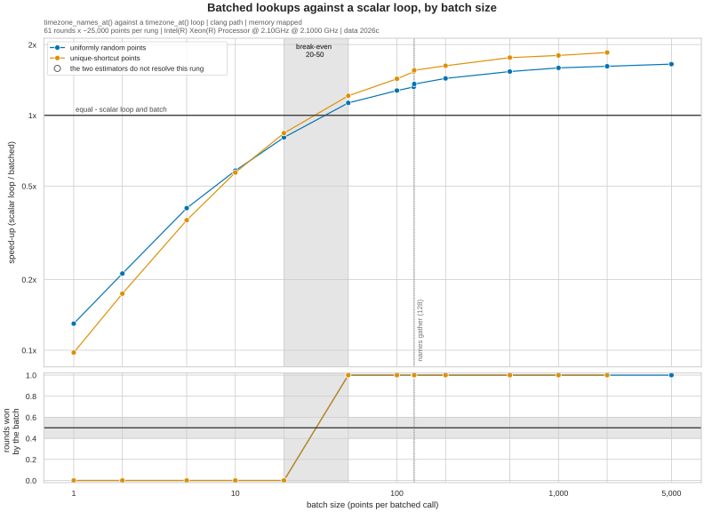

When Batched Lookups Pay
========================

**uniformly random points: batching starts paying between 20 and 50 points per call** for ``timezone_names_at()``, and stops improving beyond ~1,000 (1.59x the scalar loop, faster).

**unique-shortcut points: batching starts paying between 20 and 50 points per call** for ``timezone_names_at()``, and stops improving beyond ~500 (1.76x the scalar loop, faster).

*Measured on Linux x86_64, Intel(R) Xeon(R) Processor @ 2.10GHz @ 2.1000 GHz, Python 3.12.3, using the C extension (clang) point-in-polygon path.*

``timezone_names_at()`` amortises validation, the integer scaling and the shortcut table read over a whole batch, but still pays one ``h3`` cell lookup per point and still resolves ambiguous points one at a time. So it is faster per point than calling ``timezone_at()`` in a loop only once the batch is large enough to pay back its own fixed cost. This page is where that happens, and where growing the batch further stops helping. See :doc:`benchmarking_methodology`.

.. note::

   Nothing on this page is on the continuous-integration trend chart, which tracks one fixed batch size. These are on-demand measurements, taken by ``make batch-break-even``. Both answers move with the machine *and* with the workload, so read them as this configuration's, and run the script on your own coordinates to get yours.

How this is measured
--------------------

Each row below is one paired comparison: a ``timezone_at()`` loop over N points against a single ``timezone_names_at()`` call on the same N points, with the same draw handed to both candidates, the order alternating round by round, and two estimators reported so that a difference neither can demonstrate reads as ``unresolved`` rather than as a number (``benchmarks/candidate_comparison.py``).

Every rung times the same amount of work - about 25,000 points per round, whatever the batch size - so the rungs are comparable to each other, and both answers are read off the ratio *within* a rung rather than off absolute times across rungs, which is what keeps drift over the run out of the curve. Points are drawn without replacement inside a batch: a repeated coordinate would be answered from the batch's own cell lookup and would flatter exactly the effect being measured.

The coordinate arrays are prepared before the clock starts, in the contiguous ``float64`` form the batch API takes without copying. A caller holding Python lists pays one conversion per axis per call on top of what these rows show.

The sweep
---------

The upper panel is the best-round speed-up; the lower one is the share of rounds the batched call won, which assumes nothing about how the noise is distributed. A difference is believed only where both agree, so the shaded band - where the crossing lies - is exactly where the upper panel passes 1.0 and the lower one passes one half. Hollow markers are rungs neither estimator resolves.

The dotted rule at 128 is not a measurement artefact: ``ZoneNames.names_of`` converts ids to names with a Python loop below that size and a numpy gather at or above it, so the per-point cost steps there.

Batch size against speed-up, uniformly random points
----------------------------------------------------

.. list-table::
   :header-rows: 1
   :widths: 11 31 31 9 11 7

   * - Batch size
     - timezone_at() loop, per point
     - timezone_names_at(), per point
     - Speed-up
     - Rounds won
     - Verdict
   * - 1
     - 1.53µs
     - 11.8µs
     - 0.13x
     - 0 of 61
     - slower
   * - 2
     - 1.37µs
     - 6.46µs
     - 0.21x
     - 0 of 61
     - slower
   * - 5
     - 1.32µs
     - 3.28µs
     - 0.40x
     - 0 of 61
     - slower
   * - 10
     - 1.28µs
     - 2.20µs
     - 0.58x
     - 0 of 61
     - slower
   * - 20
     - 1.26µs
     - 1.56µs
     - 0.81x
     - 0 of 61
     - slower
   * - 50
     - 1.29µs
     - 1.14µs
     - 1.13x
     - 61 of 61
     - faster
   * - 100
     - 1.25µs
     - 978ns
     - 1.27x
     - 61 of 61
     - faster
   * - 127
     - 1.23µs
     - 930ns
     - 1.32x
     - 61 of 61
     - faster
   * - 128
     - 1.25µs
     - 924ns
     - 1.36x
     - 61 of 61
     - faster
   * - 200
     - 1.23µs
     - 856ns
     - 1.44x
     - 61 of 61
     - faster
   * - 500
     - 1.24µs
     - 806ns
     - 1.54x
     - 61 of 61
     - faster
   * - 1,000
     - 1.23µs
     - 775ns
     - 1.59x
     - 61 of 61
     - faster
   * - 2,000
     - 1.24µs
     - 766ns
     - 1.62x
     - 61 of 61
     - faster
   * - 5,000
     - 1.24µs
     - 752ns
     - 1.65x
     - 61 of 61
     - faster

The crossing is reported as the interval (20, 50] rather than as a number, because that is all a ladder of discrete sizes can establish. The rungs inside it read ``no difference`` or ``unresolved`` by construction: that is what it means for the crossing to be in there, not a defect in the run.

Control: the scalar loop answers the same points at every rung, so its per-point time should not depend on the batch size. Across the 11 rungs at or above N=10 it spread **5.0 %** (1.23µs to 1.29µs), against a 15 % threshold - so the ladder measured one thing. It is published as the reader's check and is never divided into anything. The smaller rungs are excluded because the harness's own per-batch cost lands on them divided by a very small N.

Batch size against speed-up, unique-shortcut points
---------------------------------------------------

.. list-table::
   :header-rows: 1
   :widths: 11 31 31 9 11 7

   * - Batch size
     - timezone_at() loop, per point
     - timezone_names_at(), per point
     - Speed-up
     - Rounds won
     - Verdict
   * - 1
     - 1.03µs
     - 10.6µs
     - 0.10x
     - 0 of 61
     - slower
   * - 2
     - 974ns
     - 5.59µs
     - 0.17x
     - 0 of 61
     - slower
   * - 5
     - 934ns
     - 2.61µs
     - 0.36x
     - 0 of 61
     - slower
   * - 10
     - 906ns
     - 1.59µs
     - 0.57x
     - 0 of 61
     - slower
   * - 20
     - 891ns
     - 1.06µs
     - 0.84x
     - 0 of 61
     - slower
   * - 50
     - 864ns
     - 714ns
     - 1.21x
     - 61 of 61
     - faster
   * - 100
     - 872ns
     - 610ns
     - 1.43x
     - 61 of 61
     - faster
   * - 127
     - 929ns
     - 606ns
     - 1.53x
     - 61 of 61
     - faster
   * - 128
     - 887ns
     - 571ns
     - 1.55x
     - 61 of 61
     - faster
   * - 200
     - 880ns
     - 541ns
     - 1.63x
     - 61 of 61
     - faster
   * - 500
     - 876ns
     - 497ns
     - 1.76x
     - 61 of 61
     - faster
   * - 1,000
     - 868ns
     - 483ns
     - 1.80x
     - 61 of 61
     - faster
   * - 2,000
     - 895ns
     - 484ns
     - 1.85x
     - 61 of 61
     - faster

The crossing is reported as the interval (20, 50] rather than as a number, because that is all a ladder of discrete sizes can establish. The rungs inside it read ``no difference`` or ``unresolved`` by construction: that is what it means for the crossing to be in there, not a defect in the run.

Control: the scalar loop answers the same points at every rung, so its per-point time should not depend on the batch size. Across the 10 rungs at or above N=10 it spread **7.5 %** (864ns to 929ns), against a 15 % threshold - so the ladder measured one thing. It is published as the reader's check and is never divided into anything. The smaller rungs are excluded because the harness's own per-batch cost lands on them divided by a very small N.

What this does not say
----------------------

**Both answers are properties of the workload, not only of the library.** The batch path answers every point that falls in one H3 cell from a single lookup, so a clustered stream - a delivery round, a city, a sensor network - amortises sooner than the uniformly random points measured here, which share almost nothing. Random points are the conservative case.

They are also properties of this machine and this acceleration path. ``scripts/measure_batch_break_even.py`` takes ``--points your.csv`` (two columns, ``lng,lat``) and reports the same two numbers for your coordinates on your hardware, which is the only way to get the answer that applies to you.

Finally, ``timezone_ids_at()`` breaks even sooner than ``timezone_names_at()`` would suggest, because it never builds the answer names. It has no scalar counterpart to pair against, so it is not on this page; ``--api ids`` sweeps it as a bound.

System Status
-------------

Python Environment
~~~~~~~~~~~~~~~~~~

**Python Version**: 3.12.3 (CPython)

**NumPy Version**: 2.5.2

**Platform**: Linux x86_64

**Processor**: x86_64

TimezoneFinder Configuration
~~~~~~~~~~~~~~~~~~~~~~~~~~~~

**C Implementation Available**: True

**Numba JIT Available**: False

Performance Optimizations
~~~~~~~~~~~~~~~~~~~~~~~~~

* ✓ Compiled C extension for point-in-polygon operations

* ✗ Numba JIT compilation not available

Benchmark Input Provenance
~~~~~~~~~~~~~~~~~~~~~~~~~~

**Fixture Version**: 3

**Timezone Data Version**: 2026c

Benchmark Configuration
~~~~~~~~~~~~~~~~~~~~~~~

**Rounds Per Rung**: 61

**Points Per Round**: ~25,000

**Coordinate Access**: memory mapped
