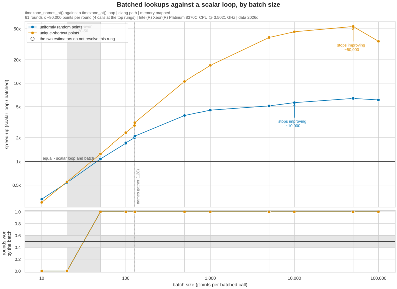

When Batched Lookups Pay
========================

**uniformly random points: batching starts paying between 50 and 100 points per call** for ``timezone_names_at()``, and stops improving beyond ~50,000 (6.50x the scalar loop, faster).

**unique-shortcut points: batching starts paying between 20 and 50 points per call** for ``timezone_names_at()``, and stops improving beyond ~50,000 (52.5x the scalar loop, faster); from 100,000 points it is slower per point again.

*Measured on Linux x86_64, AMD EPYC 7763 64-Core Processor @ 2.4454 GHz, Python 3.13.16, using the C extension (clang) point-in-polygon path.*

``timezone_names_at()`` spreads its fixed cost per call over the whole batch, so it beats a ``timezone_at()`` loop only above some batch size, and stops getting faster per point at a larger one. Both depend on the machine and on how clustered the coordinates are - points sharing a shortcut cell are answered together, so a clustered stream pays off sooner than the uniformly random points measured here. Run ``scripts/measure_batch_break_even.py --points your.csv`` (columns ``lng,lat``) to measure your own. How the sweep is taken: :doc:`benchmarking_methodology`.

The sweep
---------

Speed-up of one batched call over the loop on the same points. The shaded band is where batching starts paying, an arrow marks where it stops improving, and hollow markers are batch sizes with no clear winner. The dotted line at 128 is where ``ZoneNames.names_of`` switches from a Python loop to a numpy gather.

Batch size against speed-up, uniformly random points
----------------------------------------------------

.. list-table::
   :header-rows: 1
   :widths: 10 30 32 8 10 10

   * - Batch size
     - timezone_at() loop, per point
     - timezone_names_at(), per point
     - Speed-up
     - Rounds won
     - Verdict
   * - 10
     - 1.60µs
     - 5.23µs
     - 0.31x
     - 0 of 61
     - slower
   * - 20
     - 1.48µs
     - 3.00µs
     - 0.49x
     - 0 of 61
     - slower
   * - 50
     - 1.50µs
     - 1.49µs
     - 1.00x
     - 44 of 61
     - unresolved
   * - 100
     - 1.48µs
     - 927ns
     - 1.59x
     - 61 of 61
     - faster
   * - 127
     - 1.47µs
     - 808ns
     - 1.82x
     - 61 of 61
     - faster
   * - 128
     - 1.46µs
     - 770ns
     - 1.90x
     - 61 of 61
     - faster
   * - 500
     - 1.42µs
     - 395ns
     - 3.59x
     - 61 of 61
     - faster
   * - 1,000
     - 1.46µs
     - 329ns
     - 4.44x
     - 61 of 61
     - faster
   * - 5,000
     - 1.44µs
     - 262ns
     - 5.50x
     - 61 of 61
     - faster
   * - 10,000
     - 1.49µs
     - 246ns
     - 6.04x
     - 61 of 61
     - faster
   * - 50,000
     - 1.48µs
     - 228ns
     - 6.50x
     - 61 of 61
     - faster
   * - 100,000
     - 1.43µs
     - 232ns
     - 6.16x
     - 61 of 61
     - faster

Check: the loop's per-point time, which should not depend on the batch size, varied **12.8 %** across batch sizes from 10 up (limit 15 %).

Batch size against speed-up, unique-shortcut points
---------------------------------------------------

.. list-table::
   :header-rows: 1
   :widths: 11 31 31 9 11 7

   * - Batch size
     - timezone_at() loop, per point
     - timezone_names_at(), per point
     - Speed-up
     - Rounds won
     - Verdict
   * - 10
     - 1.12µs
     - 4.20µs
     - 0.27x
     - 0 of 61
     - slower
   * - 20
     - 1.10µs
     - 2.24µs
     - 0.49x
     - 0 of 61
     - slower
   * - 50
     - 1.11µs
     - 969ns
     - 1.14x
     - 61 of 61
     - faster
   * - 100
     - 1.18µs
     - 529ns
     - 2.23x
     - 61 of 61
     - faster
   * - 127
     - 1.15µs
     - 434ns
     - 2.64x
     - 61 of 61
     - faster
   * - 128
     - 1.17µs
     - 394ns
     - 2.96x
     - 61 of 61
     - faster
   * - 500
     - 1.12µs
     - 120ns
     - 9.35x
     - 61 of 61
     - faster
   * - 1,000
     - 1.10µs
     - 74.2ns
     - 14.8x
     - 61 of 61
     - faster
   * - 5,000
     - 1.08µs
     - 31.6ns
     - 34.3x
     - 61 of 61
     - faster
   * - 10,000
     - 1.07µs
     - 26.4ns
     - 40.7x
     - 61 of 61
     - faster
   * - 50,000
     - 1.14µs
     - 21.8ns
     - 52.5x
     - 61 of 61
     - faster
   * - 100,000
     - 1.13µs
     - 37.2ns
     - 30.3x
     - 61 of 61
     - faster

Check: the loop's per-point time, which should not depend on the batch size, varied **10.0 %** across batch sizes from 10 up (limit 15 %).

This page measures name-returning lookups. ``scripts/measure_batch_break_even.py --api ids`` compares ``timezone_ids_at()`` against a ``timezone_id_at()`` loop instead.

System Status
-------------

Python Environment
~~~~~~~~~~~~~~~~~~

**Python Version**: 3.13.16 (CPython)

**NumPy Version**: 2.5.2

**Platform**: Linux x86_64

**Processor**: x86_64

TimezoneFinder Configuration
~~~~~~~~~~~~~~~~~~~~~~~~~~~~

**C Implementation Available**: True

**Numba JIT Available**: False

Performance Optimizations
~~~~~~~~~~~~~~~~~~~~~~~~~

* ✓ Compiled C extension for point-in-polygon operations

* ✗ Numba JIT compilation not available

Benchmark Input Provenance
~~~~~~~~~~~~~~~~~~~~~~~~~~

**Fixture Version**: 4

**Timezone Data Version**: 2026d

Benchmark Configuration
~~~~~~~~~~~~~~~~~~~~~~~

**Rounds Per Rung**: 61

**Points Per Round**: ~80,000

**Coordinate Access**: memory mapped
