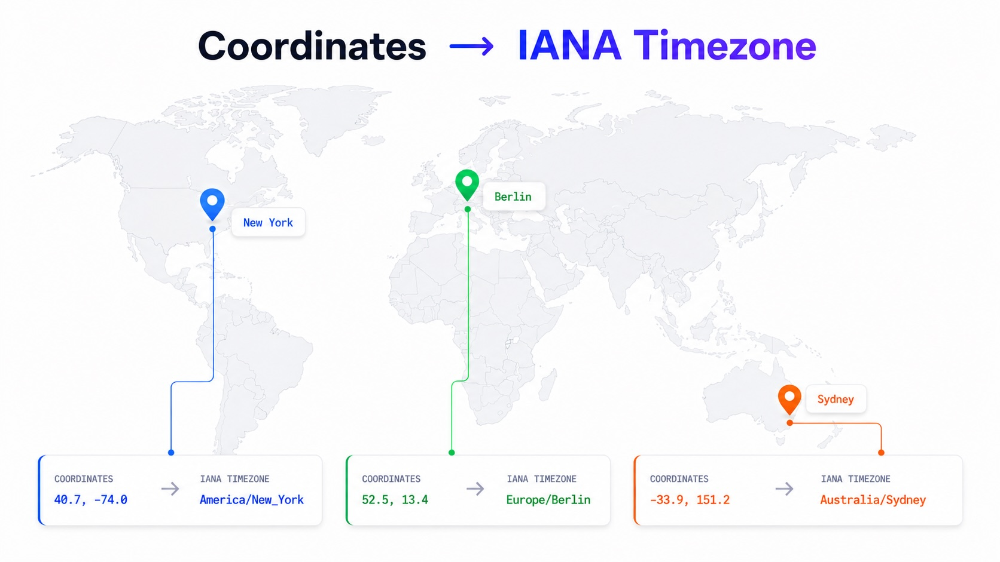

============================
timezonefinder
============================

.. include:: ./badges.rst

This is a python package providing offline timezone lookups for WGS84 coordinates.
In comparison to other alternatives this package aims at maximum accuracy around timezone borders (no geometry simplifications) while offering fast lookup performance and compatibility with many (Python) runtime environments.
It combines preprocessed polygon data, H3-based spatial shortcuts, and optional acceleration via Numba or a clang-backed point-in-polygon routine.

How it works
------------

A lookup scales the coordinates to 32-bit integers (x 10\ :sup:`7`, ~1.1 cm steps), finds the
point's H3 hexagon at resolution 4 (~288k cells worldwide), and reads a precomputed shortcut for that
cell. Most cells are covered by a single timezone, so the answer is returned immediately with no
geometry touched at all. Only an ambiguous cell falls through to the polygons it lists: bounding-box
rejection first, then a ray-casting point-in-polygon test - holes before the outer ring, since holes
are smaller and can reject the polygon outright. :doc:`architecture` walks through the full pipeline;
:doc:`data_format` documents the binary layouts.

The central trade-off: **the boundary polygons are never simplified**, so border accuracy is limited
only by the source dataset. The H3 index is what makes carrying full-resolution geometry affordable,
and :doc:`benchmarking_methodology` describes how the resulting numbers are measured.

Since the dataset includes ocean zones, every coordinate on earth matches some timezone -
``timezone_at()`` therefore effectively never returns ``None``; use ``timezone_at_land()`` when you
need to tell land from sea.

References
----------

* `Documentation <https://timezonefinder.readthedocs.io/en/latest/>`__
* `PyPI <https://pypi.python.org/pypi/timezonefinder/>`__
* `conda-forge feedstock <https://github.com/conda-forge/timezonefinder-feedstock>`__
* `download stats <https://pepy.tech/project/timezonefinder>`__
* `online GUI and API <https://timezonefinder.michelfe.it>`__
* `benchmark trend chart <https://jannikmi.github.io/timezonefinder/dev/bench/>`__
* `GUI repository <https://github.com/jannikmi/timezonefinder_gui>`__
* `ruby port <https://github.com/gunyarakun/timezone_finder>`__

.. toctree::
   :maxdepth: 2
   :caption: Using it

   Getting Started <0_getting_started>
   Usage <1_usage>
   Use Cases <2_use_cases>
   API <4_api>

.. toctree::
   :maxdepth: 2
   :caption: Design

   Architecture <architecture>
   Data Format <data_format>
   Data Report <data_report>
   Alternatives <alternatives>

.. toctree::
   :maxdepth: 2
   :caption: Performance

   Overview <7_performance>
   Benchmarking Methodology <benchmarking_methodology>
   Timezone Finding Benchmarks <benchmark_results_timezonefinding>
   Point-in-Polygon Benchmarks <benchmark_results_polygon>
   Initialization Benchmarks <benchmark_results_initialization>
   Memory Benchmarks <benchmark_results_memory>
   Comparison against tzfpy <benchmark_results_comparison>

.. toctree::
   :maxdepth: 2
   :caption: Project

   About <3_about>
   Contributing <5_contributing>
   Changelog <6_changelog>

Indices and tables
==================

* :ref:`genindex`
* :ref:`modindex`
* :ref:`search`
